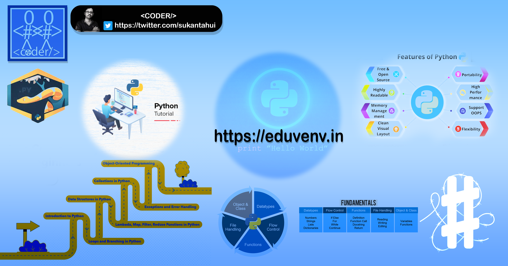

  <h1> 30 Days Of Python: Day 30- Conclusions</h1>
  
  

Author:
<a href="https://www.linkedin.com/in/sukantahui/" target="_blank">Sukanta Hui</a> 
<small> Second Edition: July, 2021</small>

[<< Day 29](../29_Day_Building_API/29_building_API.md)

- [Day 30](#day-30)
  - [Conclusions](#conclusions)

# Day 30

🎉 CONGRATULATIONS ! 🎉

[<< Day 29](../29_Day_Building_API/29_building_API.md)
